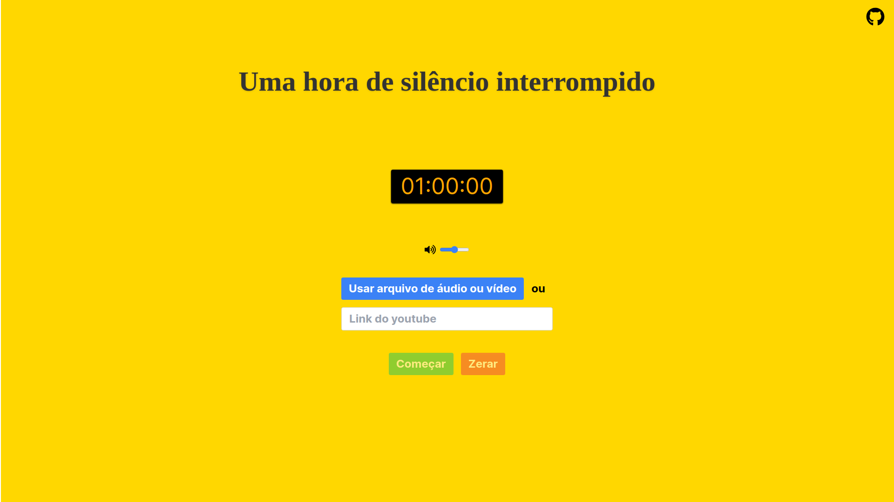

# Hora de Silêncio Interrompido

###### [In english](../../README.md)

Um site que permite que você experimente uma hora de silêncio interrompido. Você pode personalizar o áudio fornecendo um URL de vídeo do YouTube ou usando arquivos de áudio ou vídeo do seu dispositivo.

## Acesse o Site

Você pode acessar o site usando os seguintes URLs:

- [https://hdsi.vercel.app](https://hdsi.vercel.app)
- [https://horadesilenciointerrompido.vercel.app](https://horadesilenciointerrompido.vercel.app)

## Detalhes do Projeto

Este projeto é construído usando as seguintes tecnologias:

- ⚡ Vite: Uma ferramenta de compilação rápida para aplicativos web modernos.
-  React: Uma biblioteca JavaScript para construir interfaces de usuário.
-  Typescript: Um superset tipado de JavaScript que compila para JavaScript puro.
- 🎭 Playwright: Um framework de teste end-to-end para aplicativos web.
-  Tailwind CSS: Um framework CSS de utility-first para desenvolvimento rápido de UI.
- 🌎 i18next: Um framework de internacionalização para navegador ou qualquer outro ambiente JavaScript.

## Contribuindo

Contribuições são bem-vindas! Se você tiver alguma ideia, sugestão ou relatório de bug, abra uma issue ou envie um pull request.

## Licença

Este projeto é licenciado sob a [Licença MIT](LICENSE).
